<!--
  Hi, I'm Hassan 👋

  This README is generated, not hand-typed:
    - contrib-heatmap.svg is rebuilt daily from real, live GitHub contribution
      data (scripts/fetch_contributions.py -> scripts/render_heatmap_svg.py),
      committed back automatically by .github/workflows/update-profile-art.yml
    - syed-ascii.svg is a real photo (background pre-removed) run through a
      contrast + ASCII-density pipeline (scripts/prep_photo.py -> make_ascii_svg.py)
    - info-card.svg is a small "neofetch"-style content model
      (scripts/make_info_card.py)

  All three are static SVGs with embedded SMIL/CSS animations, so they
  animate once on load right here in the README -- no JS required, GitHub
  renders it natively.
-->

<h3>$ ./contributions.sh</h3>

  

<h3>$ whoami</h3>

<table>
  <tr>
    <td></td>
    <td valign="top"></td>
  </tr>
</table>

<h3>$ ./links.sh</h3>

<b>IT Undergraduate at QUEST Nawabshah | Backend Developer | LLM Engineer | Python · FastAPI · RAG | Game Dev Enthusiast</b>

  
  
  
  <!-- send a portfolio URL or a live-demo link and I'll add a matching badge here -->

