<div align="center">

# Syed Hassan Ahmed Zaidi
`syedhassanstudies-rgb@github`

IT Undergraduate at QUEST Nawabshah | Backend Developer | LLM Engineer | Python · FastAPI · RAG | Game Dev Enthusiast

[](https://linkedin.com/in/syed-hassan-ahmed-zaidi)
[](https://github.com/syedhassanstudies-rgb)
[](mailto:syedhassanstudies@gmail.com)

</div>

---

### `$ whoami`

<div align="center">
  
  
</div>

---

### `$ ./tech-stack.sh`

```console
[LANGUAGES]    :: Python | C++ | JavaScript | SQL | HTML/CSS
[FRAMEWORKS]   :: FastAPI | React | SQLAlchemy | Tailwind CSS | Framer Motion
[AI / LLM]     :: RAG Pipelines | FAISS | Gemini API | Groq API | Prompt Engineering
[CLOUD & TOOLS]:: AWS (EC2) | Docker | Nginx | Git/GitHub | Linux | Vercel